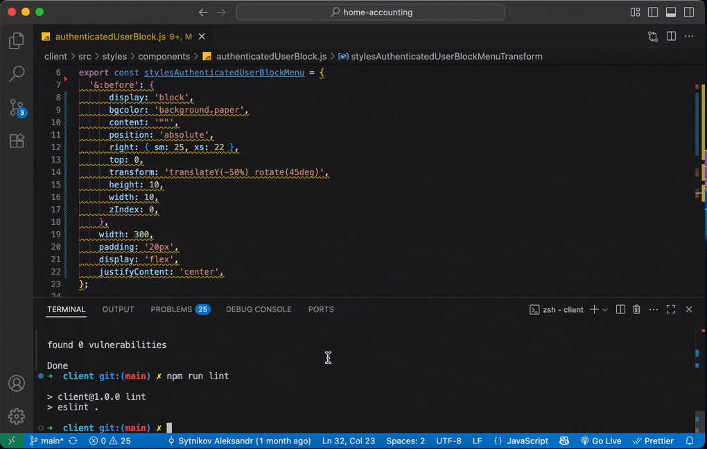

# 🚀 ESLint Plugin to Auto-Sort MUI sx Properties

<p align="center">
  
  
</p>

An ESLint plugin and rule with autofix that automatically sorts **Material-UI (MUI) `sx` style properties** for consistent, clean, and maintainable code. Works great with React/Next.js, Prettier, JavaScript and TypeScript.

---

## Table of Contents

- [Why Use This Plugin?](#-why-use-this-plugin)
- [Key Features](#-key-features)
- [Install](#-install)
- [Configuration](#-configuration-example)
- [Usage & Auto-fix](#-usage--auto-fix)
- [Before / After (Autofix)](#before--after-autofix)
- [FAQ](#faq)
- [Development](#-development)

<p align="center">
  <a href="https://www.npmjs.com/package/eslint-plugin-mui-sx-order">
    
  </a>
  <a href="https://www.npmjs.com/package/eslint-plugin-mui-sx-order">
    
  </a>
  <a href="./LICENSE">
    
  </a>
  <a href="https://github.com/sytnikovzp/eslint-plugin-mui-sx-order/actions">
    
  </a>
</p>

---

## 🌟 Why Use This Plugin?

Maintaining a **consistent and logical order of MUI `sx` style properties** is critical for:

- ✅ Code readability
- ✅ Easier debugging and maintenance
- ✅ Team-wide styling best practices

This plugin:

- 🔥 Automatically sorts `sx` properties in your React components
- 📦 Supports nested selectors (`&:hover`) and responsive breakpoints (`xs`, `sm`, `md`)
- ⚡ Works with ESLint and Prettier for a seamless developer experience

---

## ✨ Key Features

- 📦 **Automatic sorting (ESLint rule with autofix)** of all `sx` properties, even nested objects
- 🔥 Supports pseudo-classes, nested selectors, and media query keys
- 🛠 Fully compatible with `eslint --fix`
- 🚀 Supports JavaScript and TypeScript projects out of the box
- 📦 Built with TypeScript for better type safety and maintainability
- ⚡ Zero dependencies → ultra-fast linting

---

## 🔥 Why not just use Prettier?

Prettier is great for formatting, but it doesn’t understand the logical groups of MUI sx properties.
This ESLint rule enforces a best-practice order (optimized for MUI System `sx`):

1. **Positioning**: `position`, `top`, `right`, `zIndex`, and others.
2. **Display & Layout**: `display`, `boxSizing`, `visibility`, and others.
3. **Flexbox**: `flex`, `flexBasis`, `flexDirection`, and others.
4. **Grid**: `grid`, `gridArea`, `gridTemplate`, and others.
5. **Spacing & Box Model**: `width`, `minWidth`, `maxWidth`, and others.
6. **Typography**: `font`, `fontFamily`, `fontSize`, and others.
7. **Background & Effects**: `background`, `backgroundColor`, `boxShadow`, and others.
8. **Transitions & Animations**: `transition`, `animation`, `transform`, and others.

---

## 📦 Install

Add the plugin to your project as a dev dependency:

```bash
npm i -D eslint-plugin-mui-sx-order
```

or with Yarn:

```bash
yarn add -D eslint-plugin-mui-sx-order
```

---

## ⚙️ Configuration Example

### For `.eslintrc.js` (CommonJS format):

```js
module.exports = {
  plugins: ['mui-sx-order'],
  rules: {
    'mui-sx-order/sort-sx-properties': 'warn',
  },
};
```

### For `.eslintrc` or `.eslintrc.json` (JSON format):

```json
{
  "plugins": ["mui-sx-order"],
  "rules": {
    "mui-sx-order/sort-sx-properties": "warn"
  }
}
```

### For `.eslint.config.js` (ES module format):

```js
import muiSxOrder from 'eslint-plugin-mui-sx-order';

export default {
  plugins: {
    'mui-sx-order': muiSxOrder,
  },
  rules: {
    'mui-sx-order/sort-sx-properties': 'warn',
  },
};
```

---

## 🛠 Usage & Auto-fix

You can automatically fix the property order using:

```bash
npx eslint --fix .
```

This will sort all sx properties in your project.

---

## Before / After (Autofix)

Before (unsorted `sx`):

```tsx
// React / MUI
<Box sx={{ padding: 2, margin: 1, backgroundColor: '#eee' }} />
```

After (autofix by ESLint rule):

```tsx
<Box sx={{ margin: 1, padding: 2, backgroundColor: '#eee' }} />
```

Multiline object:

```js
// Before
const sx = {
  backgroundColor: '#f5f5f5',
  position: 'relative',
  padding: 8,
  margin: 16,
  display: 'flex',
};

// After (eslint --fix)
const sx = {
  position: 'relative',
  display: 'flex',
  margin: 16,
  padding: 8,
  backgroundColor: '#f5f5f5',
};
```

Responsive and nested selectors are handled too:

```js
const sx = {
  sm: { margin: 1, padding: 2 },
  '&:hover': { backgroundColor: '#f5f5f5' },
};
```

---

## FAQ

- **Is this compatible with Prettier?**  
  Yes. Prettier handles formatting; this plugin enforces logical property order via an ESLint rule with autofix.

- **Will it reorder across spread props?**  
  No. `...spread` blocks are preserved; the rule safely reorders only adjacent properties around them.

- **Does it sort nested objects and responsive breakpoints?**  
  Yes. Nested objects (e.g., `&:hover`) and responsive keys (`xs`, `sm`, `md`, `lg`, `xl`) are supported.

- **Does it touch non-MUI code?**  
  The rule targets `sx`/style-like objects; for `createStyles`, it only applies when imported from MUI packages.

- **What ESLint/Node versions are supported?**  
  Node.js 18+, ESLint 8+. Tested with React 18 and Next.js.

Useful links:

- MUI System `sx`: https://mui.com/system/getting-started/the-sx-prop/
- ESLint Rules and Autofix: https://eslint.org/docs/latest/extend/custom-rules

## 📢 Perfect for Teams & Open Source Projects

Ensure a **consistent style guide** for all MUI projects in your team.
Great for **large codebases** where property order matters for readability.

---

## 🛠 Development

This plugin is built with TypeScript for better type safety and maintainability.

### Prerequisites

- Node.js >= 18
- npm or yarn

### Setup

```bash
# Install dependencies
npm install

# Build the project
npm run build

# Run tests
npm test

# Watch mode for development
npm run dev
```

### Project Structure

```
src/
├── index.ts                 # Main plugin entry point
├── lib/
│   ├── types.ts            # TypeScript type definitions
│   ├── rules/
│   │   └── sort-sx-properties.ts # Main rule implementation
│   └── utils/
│       ├── preferredOrder.ts    # CSS property ordering
│       ├── propertyUtils.ts     # Utility functions
│       └── checkAndReport.ts    # Linting logic
```

## 📜 License

This project is licensed under the MIT License - see the [LICENSE](./LICENSE) file for details.
