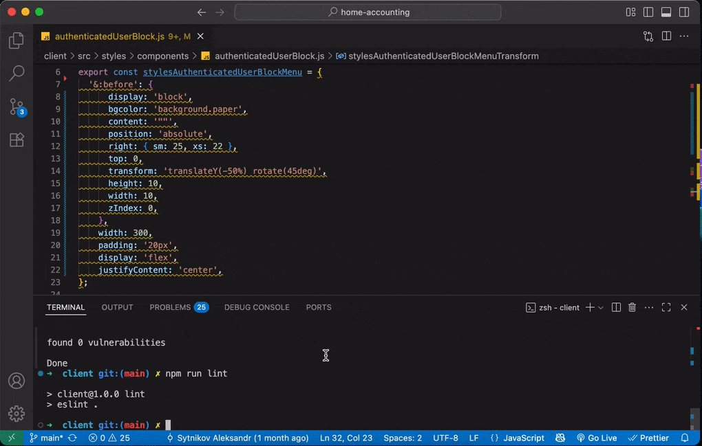

# 🚀 ESLint Plugin to Auto-Sort MUI sx Properties

<p align="center">
  
</p>

Automatically sort and organize **Material-UI (MUI) sx style properties** in your ESLint workflow.  
Improve code consistency, readability, and maintainability in **JavaScript** and **TypeScript** projects with zero manual effort.

<p align="center">
  <a href="https://www.npmjs.com/package/eslint-plugin-mui-sx-order">
    
  </a>
  <a href="https://www.npmjs.com/package/eslint-plugin-mui-sx-order">
    
  </a>
  <a href="./LICENSE">
    
  </a>
  <a href="https://github.com/sytnikovzp/eslint-plugin-mui-sx-order/actions">
    
  </a>
</p>

---

## 🌟 Why Use This Plugin?

If you use Material-UI (MUI) sx styling in your React projects, maintaining a consistent and logical order of style properties is important for readability and maintainability.

This ESLint plugin helps you by:

- Automatically sorting all sx properties based on an opinionated, industry-standard order
- Supporting nested selectors (like `&:hover`) and responsive keys (`xs`, `sm`, `md`)
- Integrating seamlessly with your existing ESLint and Prettier setup
- Working in both JavaScript and TypeScript projects

---

## ✨ Features

- 📦 Automatic sorting of all MUI sx properties, including nested objects
- 🔥 Supports pseudo-classes, nested selectors, and media query keys
- 🛠 Fully compatible with `eslint --fix` for auto-correction
- ⚡ Lightweight, fast, and zero dependencies

---

## 🔥 Why not just use Prettier?

Prettier is great for formatting, but it doesn’t understand the logical groups of MUI sx properties.
This plugin enforces an opinionated order:

1. **Positioning**: `position`, `top`, `right`, `zIndex`
2. **Layout**: `display`, `flex`, `grid`
3. **Spacing**: `margin`, `padding`
4. **Typography**: `fontSize`, `color`
5. **Background & Effects**: `backgroundColor`, `boxShadow`
6. **Transitions**: `transition`, `transform`
7. **Pseudo-classes & Media Queries**: `&:hover`, `xs`, `md`

---

## 📦 Install

Add the plugin to your project as a dev dependency:

```bash
npm i -D eslint-plugin-mui-sx-order
```

or with Yarn:

```bash
yarn add -D eslint-plugin-mui-sx-order
```

---

## ⚙️ Configuration

### For `.eslintrc.js` (CommonJS format):

```js
module.exports = {
  plugins: ['mui-sx-order'],
  rules: {
    'mui-sx-order/sort-sx-properties': 'warn',
  },
};
```

### For `.eslintrc` or `.eslintrc.json` (JSON format):

```json
{
  "plugins": ["mui-sx-order"],
  "rules": {
    "mui-sx-order/sort-sx-properties": "warn"
  }
}
```

### For `.eslint.config.js` (ES module format):

```js
import muiSxOrder from 'eslint-plugin-mui-sx-order';

export default {
  plugins: {
    'mui-sx-order': muiSxOrder,
  },
  rules: {
    'mui-sx-order/sort-sx-properties': 'warn',
  },
};
```

---

## 🛠 Auto-fix

You can automatically fix the property order using:

```bash
npx eslint --fix .
```

This will sort all sx properties in your project.

---

## 📜 License

This project is licensed under the MIT License - see the [LICENSE](./LICENSE) file for details.
